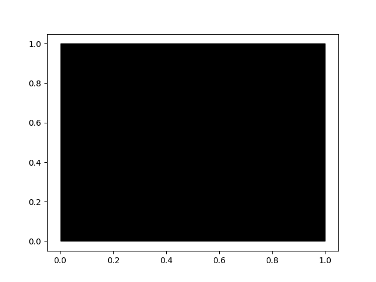
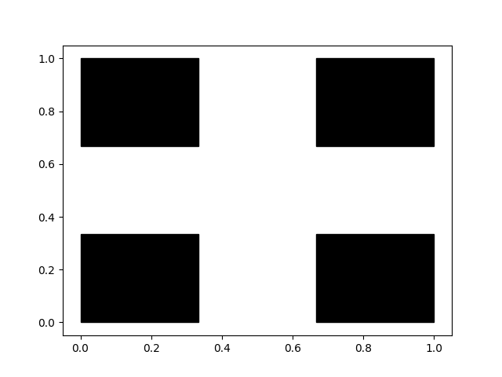
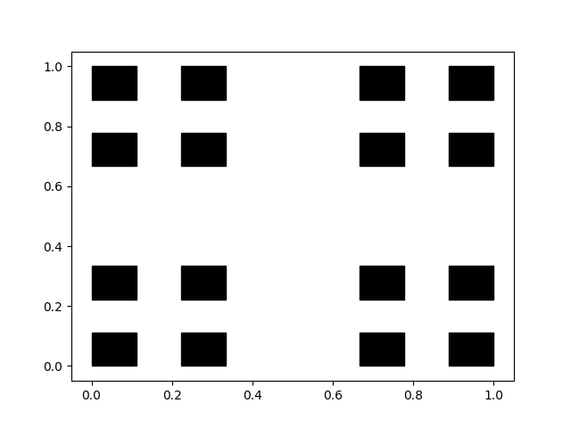
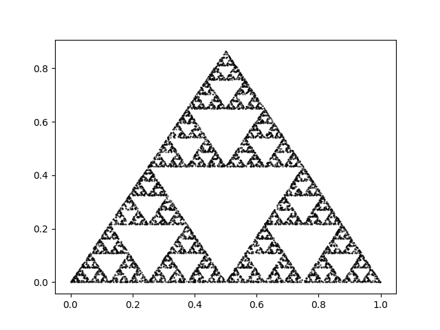
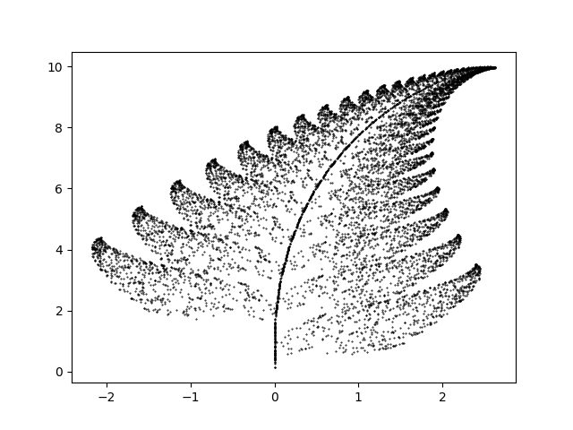
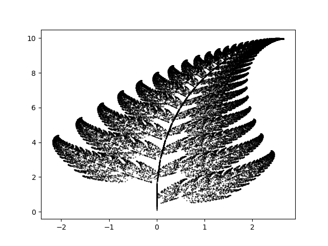
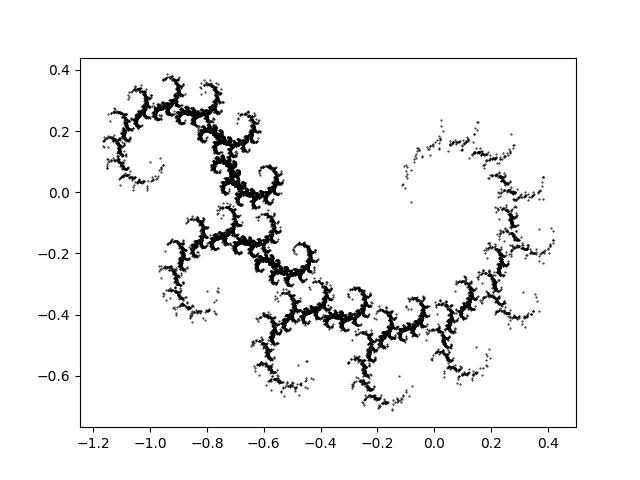

# Dywan Sierpińskiego

## Narysuj mi kwadrat

```python
import matplotlib.pyplot as plt

fig = plt.figure()
ax = fig.add_subplot(111)

ax.add_patch(plt.Rectangle((0, 0),1, 1,color="black"))
E = 0.05
plt.xlim([0-E, 1+E])
plt.ylim([0-E, 1+E])
```
<figure>
<center>

</center>
</figure>

```python
import matplotlib.pyplot as plt

fig = plt.figure()
ax = fig.add_subplot(111)

ax.add_patch(plt.Rectangle((0, 0),1/3, 1/3,color="black"))
ax.add_patch(plt.Rectangle((0+2/3, 0),1/3, 1/3,color="black"))
ax.add_patch(plt.Rectangle((0, 0+2/3),1/3,1/3,color="black"))
ax.add_patch(plt.Rectangle((0+2/3, 0+2/3),1/3, 1/3,color="black"))
E = 0.05
plt.xlim([0-E, 1+E])
plt.ylim([0-E, 1+E])
```
<figure>
<center>

</center>
</figure>

```python
import matplotlib.pyplot as plt

fig = plt.figure()
ax = fig.add_subplot(111)

ax.add_patch(plt.Rectangle((0, 0),1/9, 1/9,color="black"))
ax.add_patch(plt.Rectangle((0+2/9, 0),1/9, 1/9,color="black"))
ax.add_patch(plt.Rectangle((0, 0+2/9),1/9,1/9,color="black"))
ax.add_patch(plt.Rectangle((0+2/9, 0+2/9),1/9, 1/9,color="black"))

ax.add_patch(plt.Rectangle((0+2/3, 0),1/9, 1/9,color="black"))
ax.add_patch(plt.Rectangle((0+2/3+2/9, 0),1/9, 1/9,color="black"))
ax.add_patch(plt.Rectangle((0+2/3, 0+2/9),1/9,1/9,color="black"))
ax.add_patch(plt.Rectangle((0+2/3+2/9, 0+2/9),1/9, 1/9,color="black"))

ax.add_patch(plt.Rectangle((0, 0+2/3),1/9, 1/9,color="black"))
ax.add_patch(plt.Rectangle((0+2/9, 0+2/3),1/9, 1/9,color="black"))
ax.add_patch(plt.Rectangle((0, 0+2/3+2/9),1/9,1/9,color="black"))
ax.add_patch(plt.Rectangle((0+2/9, 0+2/3+2/9),1/9, 1/9,color="black"))

ax.add_patch(plt.Rectangle((0+2/3, 0+2/3),1/9, 1/9,color="black"))
ax.add_patch(plt.Rectangle((0+2/3+2/9, 0+2/3),1/9, 1/9,color="black"))
ax.add_patch(plt.Rectangle((0+2/3, 0+2/3+2/9),1/9,1/9,color="black"))
ax.add_patch(plt.Rectangle((0+2/3+2/9, 0+2/3+2/9),1/9, 1/9,color="black"))
E = 0.05
plt.xlim([0-E, 1+E])
plt.ylim([0-E, 1+E])
```
<figure>
<center>

</center>
</figure>

## Rekurencja

```python

```

## Prawdziwy dywan

```python

```

## Bardzo bardzo mały kwadrat wygląda jak punkt

```python

```

# Trójkąt Sierpińskiego

## Zróbmy to w R!

```python
import numpy as np
import matplotlib.pyplot as plt

def trojkat(x, y, bok):
    E = np.array([[x+bok*0,y+bok*0], [x+bok*1,y+bok*0], [x+bok*1/2,y+bok*np.sqrt(2)/2], [x+bok*0,y+bok*0]])
    return plt.Polygon(E, facecolor = 'k')
```

## Bardzo bardzo mały trójkąt wygląda jak punkt

```python

```

# Gra w chaos

## Wylosuj mi transformacje

```python
import numpy as np
import matplotlib.pyplot as plt

def function1(x,y):
  return (x/2, y/2)

def function2(x,y):
  return (x/2 + 1/2, y/2)

def function3(x,y):
  return (x/2 + 1/4, y/2 + np.sqrt(3)/4)

functions = [function1,function2,function3]

N = 10000
x, y = 0, 0
x_value = []
y_value = []

for i in range(N):
  function = np.random.choice(functions, p=list(map(lambda x: x/3,[1, 1, 1])))
  x, y = function(x,y)
  x_value.append(x)
  y_value.append(y)

plt.scatter(x_value,y_value, s=0.2, color="black")
```
<figure>
<center>

</center>
</figure>


## Paproć Barnsleya

```python
import numpy as np
import matplotlib.pyplot as plt

def function1(x,y):
  return (0., 0.16*y)

def function2(x,y):
  return (0.85*x + 0.04*y, -0.04*x + 0.85*y + 1.6)

def function3(x,y):
  return (0.2*x - 0.26*y, 0.23*x + 0.22*y + 1.6)

def function4(x,y):
  return (-0.15*x + 0.28*y, 0.26*x + 0.24*y + 0.44)

functions = [function1,function2,function3,function4]

N = 10000
x, y = 0, 0
x_value = []
y_value = []

for i in range(N):
  function = np.random.choice(functions, p=[0.01, 0.85, 0.07, 0.07])
  x, y = function(x,y)
  x_value.append(x)
  y_value.append(y)

plt.scatter(x_value,y_value, s=0.2, color="black")
```
<figure>
<center>

</center>
</figure>

## Algebra, wszędzie algebra

```python
import random
import numpy as np
import matplotlib.pyplot as plt

def fu(x,p):
    m1 = np.array([[0, 0], [0, 0.16]])
    f1 = np.array([0, 0])
    m2 = np.array([[0.85, 0.04], [-0.04, 0.85]])
    f2 = np.array([0, 1.6])
    m3 = np.array([[0.20, -0.26], [0.23, 0.22]])
    f3 = np.array([0, 1.6])
    m4 = np.array([[-0.15, 0.28], [0.26, 0.24]])
    f4 = np.array([0, 0.44])
    if   p <= 0.01: \
    return np.dot(m1, x) + f1
    elif p <= 0.86: \
    return np.dot(m2, x) + f2
    elif p <= 0.93: \
    return np.dot(m3, x) + f3
    elif p > 0.93: \
    return np.dot(m4, x) + f4

N = 50000
x, y = 0, 0
x_value = []
y_value = []

for i in range(N):
  x, y = fu(np.array([x,y]),random.random())
  x_value.append(x)
  y_value.append(y)

plt.scatter(x_value,y_value, s=0.2, color="black")
```
<figure>
<center>

</center>
</figure>

## Smok Heighwaya

```python
import random
import numpy as np
import matplotlib.pyplot as plt

def gu(x,p):
    m1 = np.array([[-0.4, 0], [0, -0.4]])
    f1 = np.array([-1, 0.1])
    m2 = np.array([[0.76, -0.4], [0.4, 0.76]])
    f2 = np.array([0, 0])
    if   p <= 0.5: \
    return np.dot(m1, x) + f1
    else: \
    return np.dot(m2, x) + f2

N = 50000
x, y = 0, 0
x_value = []
y_value = []

for i in range(N):
  x, y = gu(np.array([x,y]),random.random())
  x_value.append(x)
  y_value.append(y)

plt.scatter(x_value,y_value, s=0.2, color="black")
```
<figure>
<center>

</center>
</figure>
