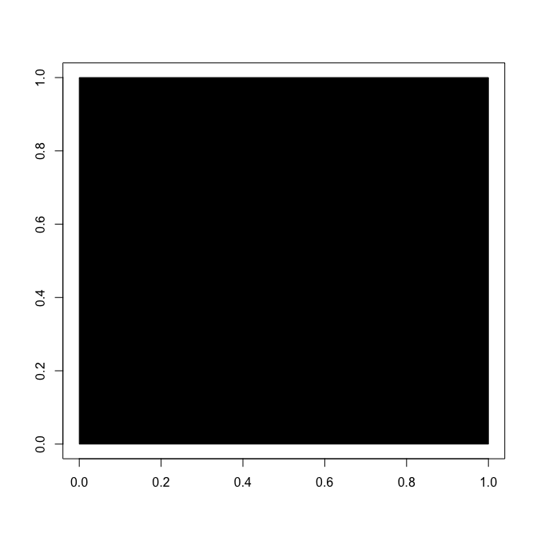
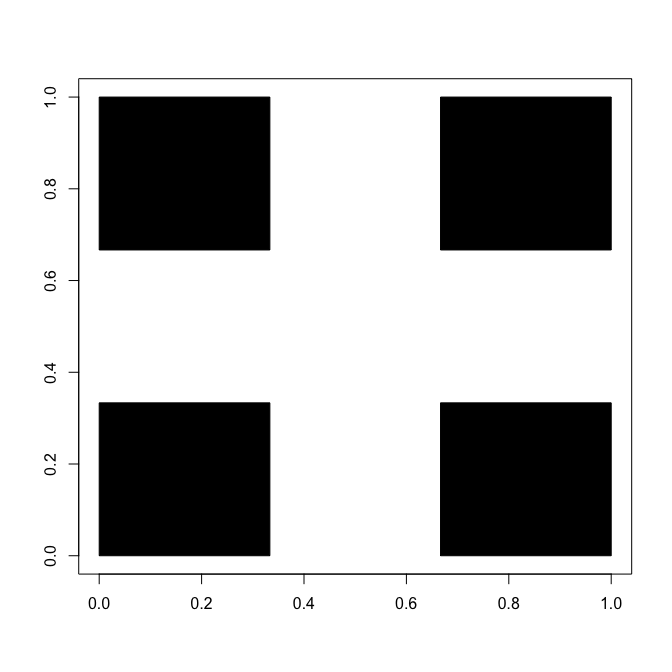
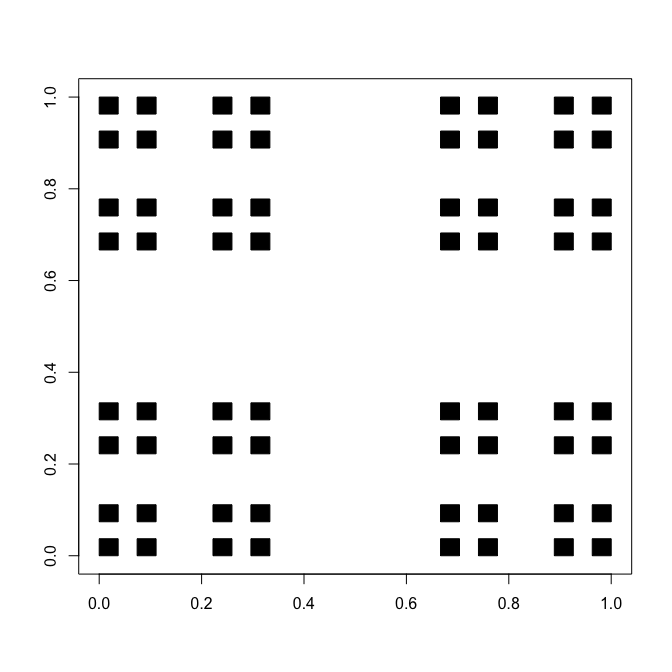
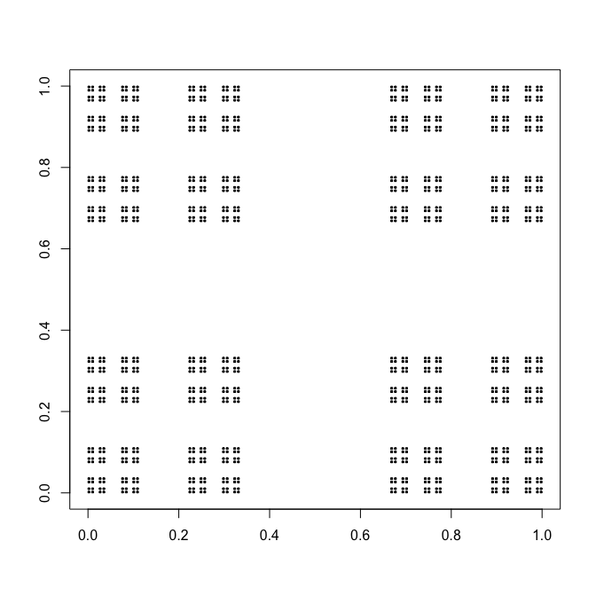
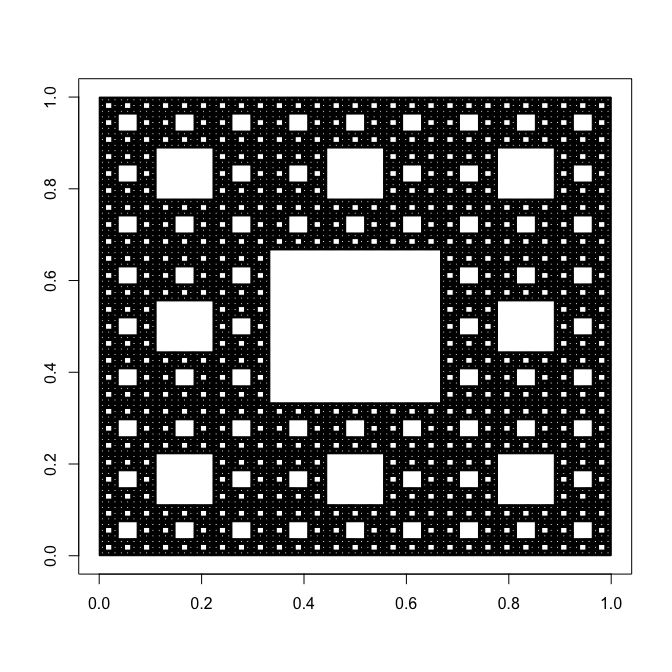
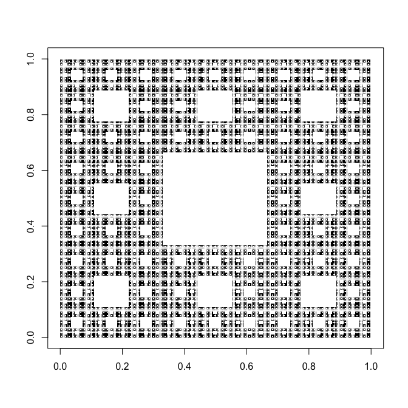
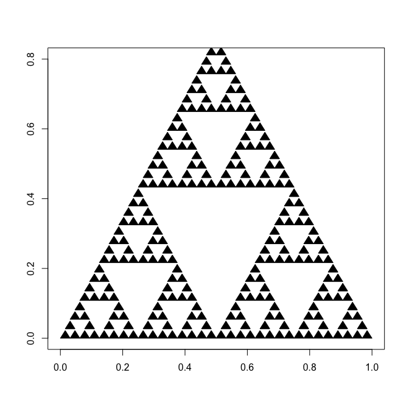
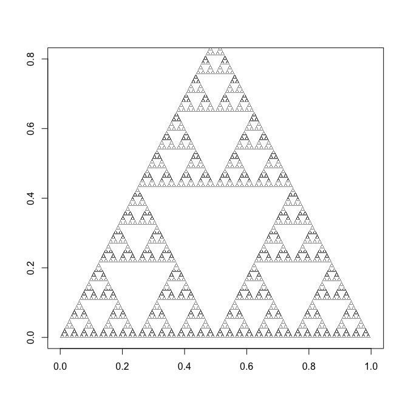
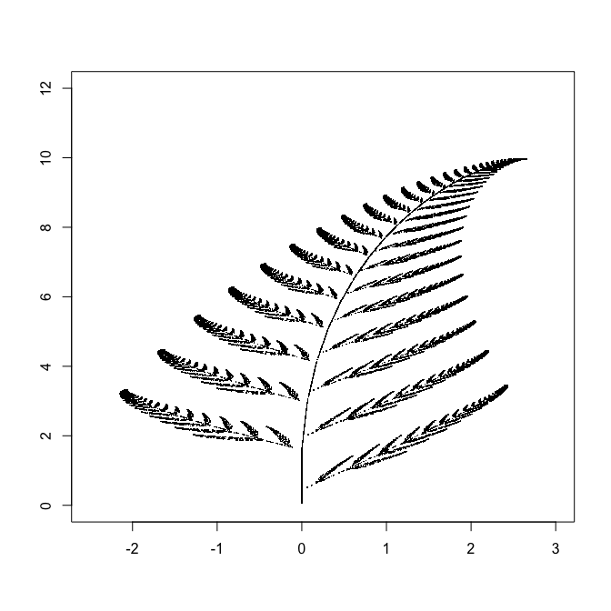
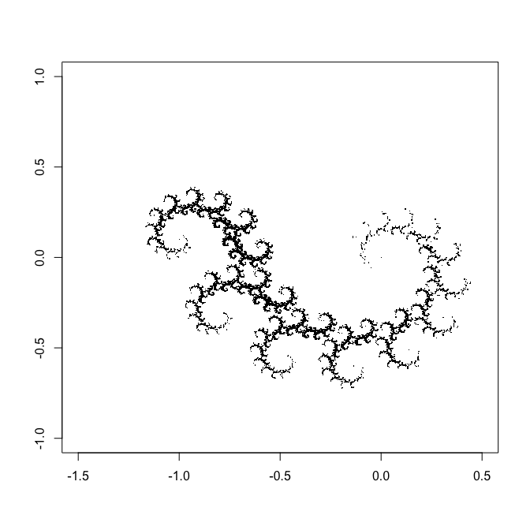

# Figury malowane nieskończonością

To fascynujące, że powtarzanie w nieskończoność tych samych czynności może prowadzić to arcyciekawych figur - fraktali.

Taką figurę może narysować każdy, wystarczy podstawowa znajomość programowania. Krok po kroku pokażemy jak skonstruować różne klasy fraktali. Znajomość podstaw algebry, prawdopodobieństwa lub topologii pozwala dokładniej zrozumieć skąd się te zaskakujące figury biorą.

Przykłady kodu poniżej są przygotowane z użyciem języka programowania R. 
Można go pobrać i zainstalować bezpłatnie ze strony https://cran.r-project.org/.

# Dywan Sierpińskiego

Prace z fraktalami rozpoczniemy od utkania [Dywanu Sierpińskiego](https://pl.wikipedia.org/wiki/Dywan_Sierpi%C5%84skiego). Zaczniemy od jego zubożonej wersji, którą trochę łatwiej opisać na początku, a później pokażemy przepis na kompletny dywan.

Jest to dobry fraktal na początek, wystarczy:

1. narysować kwadrat
2. pomniejszyć rysunek 3 razy
3. skopiować 4 razy w cztery rogi kwadratu
4. z otrzymanym rysunkiem wrócić do kroku 2

i tak w nieskończoność.

Pierwsze trzy iteracje powyższego schematu przedstawione są na rysunku poniżej.


Ok, spróbujmy to zrobić w R.

## Narysuj mi kwadrat

Zacznijmy od narysowania kwadratu.

Pierwsza linijka poniższego przykładu tworzy pusty obszar do rysowania o wymiarach [0,1]x[0,1]. 

Druga linijka zawiera instrukcje `rect()`, która rysuje czarny kwadrat rozpięty od punktu (0,0) do (1,1).


```r
# czyścimy ekran
plot(0, xlim = c(0,1), ylim = c(0,1), xlab="", ylab="", col="white")

rect(0, 0, 1, 1, col = "black")
```

<!-- -->

W drugiej iteracji ten kwadrat jest trzykrotnie pomniejszany do wymiarów 1/3 x 1/3 i rysowany w czterech rogach. Mamy do narysowania cztery kwadraty i możemy to zrobić w poniższy sposób.


```r
# czyścimy ekran
plot(0, xlim = c(0,1), ylim = c(0,1), xlab="", ylab="", col="white")

rect(0, 0, 1/3, 1/3, col = "black")
rect(0+2/3, 0, 1/3+2/3, 1/3, col = "black")
rect(0, 0+2/3, 1/3, 1/3+2/3, col = "black")
rect(0+2/3, 0+2/3, 1/3+2/3, 1/3+2/3, col = "black")
```

<!-- -->

W trzeciej iteracji w miejsce każdego z tych czterech kwadratów rysujemy kolejne 4 kwadraty trzykrotnie pomniejszone. 

W sumie będzie to 16 kwadratów, sporo ale jeszcze damy radę to zapisać.

Można to zrobić tak


```r
# czyścimy ekran
plot(0, xlim = c(0,1), ylim = c(0,1), xlab="", ylab="", col="white")

rect(0, 0, 1/9, 1/9, col = "black")
rect(0+2/9, 0, 1/9+2/9, 1/9, col = "black")
rect(0, 0+2/9, 1/9, 1/9+2/9, col = "black")
rect(0+2/9, 0+2/9, 1/9+2/9, 1/9+2/9, col = "black")

rect(0+2/3, 0, 1/9+2/3, 1/9, col = "black")
rect(0+2/3+2/9, 0, 1/9+2/3+2/9, 1/9, col = "black")
rect(0+2/3, 0+2/9, 1/9+2/3, 1/9+2/9, col = "black")
rect(0+2/3+2/9, 0+2/9, 1/9+2/3+2/9, 1/9+2/9, col = "black")

rect(0, 0+2/3, 1/9, 1/9+2/3, col = "black")
rect(0+2/9, 0+2/3, 1/9+2/9, 1/9+2/3, col = "black")
rect(0, 0+2/3+2/9, 1/9, 1/9+2/3+2/9, col = "black")
rect(0+2/9, 0+2/3+2/9, 1/9+2/9, 1/9+2/3+2/9, col = "black")

rect(0+2/3, 0+2/3, 1/9+2/3, 1/9+2/3, col = "black")
rect(0+2/3+2/9, 0+2/3, 1/9+2/3+2/9, 1/9+2/3, col = "black")
rect(0+2/3, 0+2/3+2/9, 1/9+2/3, 1/9+2/3+2/9, col = "black")
rect(0+2/3+2/9, 0+2/3+2/9, 1/9+2/3+2/9, 1/9+2/3+2/9, col = "black")
```

<!-- -->

Aby narysować dywan sierpińskiego musimy tę procedurę powtórzyć przynajmniej kilka razy, co wymaga narysowania tysięcy, a często jeszcze większej liczby, kwadratów. 

Przy takiej liczbie kwadratów kopiowanie kolejnych linijek z wywołaniem funkcji `rect` nie ma sensu.

## Rekurencja

Zrobimy to sprytniej używając rekurencji, czyli funkcji, która sama siebie wywołuje.

Skorzystamy z cechy, która nazywa się *samopodobieństwem*, czyli cały dywan jest podobny do swoich części.

Poniższy przykład przedstawia bardzo sprytną funkcję `rysuj_dywan()`. Ma ona kilka ciekawych argumentów. Pierwsze dwa `x` i `y` wskazują w którym miejscu ma być rysowany dywan, trzeci `szerokosc` określa szerokość rysowanego dywanu, a ostatni `iteracja` określa ile iteracji powyższego algorytmu powinniśmy wykonać by narysować dywan. 

Jeżeli funkcja `rysuj_dywan()` zostanie wywołana z argumentem `iteracja = 0` to narysuje sam kwadrat. Ale jeżeli zostanie wykonana z innym argumentem to narysuje cztery dywany zaczepione w rogach kwadratu o szerokości $1/3$ wyjściowego dywanu.

Zobaczmy co z tego wyjdzie!


```r
# czyścimy ekran
plot(0, xlim = c(0,1), ylim = c(0,1), xlab="", ylab="", col="white")

rysuj_dywan <- function(x, y, szerokosc, iteracja = 0) {
  if (iteracja == 0) {
    rect(x, y, x + szerokosc, y + szerokosc, col = "black")
  } else {
    rysuj_dywan(x, y, szerokosc/3, iteracja - 1)
    rysuj_dywan(x+szerokosc*2/3, y, szerokosc/3, iteracja - 1)
    rysuj_dywan(x, y+szerokosc*2/3, szerokosc/3, iteracja - 1)
    rysuj_dywan(x+szerokosc*2/3, y+szerokosc*2/3, szerokosc/3, iteracja - 1)
  }
}

rysuj_dywan(0, 0, szerokosc = 1, iteracja = 2)
```

<!-- -->

Możemy teraz w prosty sposób narysować kolejne iteracje małym nakładem kodu.

Na trzecim poziomie będzie to $4^3 = 64$ kwadratów.


```r
# czyścimy ekran
plot(0, xlim = c(0,1), ylim = c(0,1), xlab="", ylab="", col="white")

rysuj_dywan(0, 0, szerokosc = 1, iteracja = 3)
```

<!-- -->

Zobaczmy jak będzie ta figura wyglądała dla piątej iteracji. Mamy już do czynienia z $4^5 = 2^10 = 1024$ kwadratami. 


```r
# czyścimy ekran
plot(0, xlim = c(0,1), ylim = c(0,1), xlab="", ylab="", col="white")

rysuj_dywan(0, 0, szerokosc = 1, iteracja = 5)
```

<!-- -->

## Prawdziwy dywan

Widzimy już jak działa rekurencja oraz co się dzieje w kolejnych iteracjach. Jesteśmy gotowi do narysowania pełnego dywanu Sierpińskiego.

Różnica jest taka, że w każdym kroku, zamiast czterech kwadratów w rogach, będziemy rysować 8 kwadratów ,,po obwodzie'' dużego kwadratu.

W poniższej funkcji w każdym kroku z `iteracja` różnym od 0, rysujemy 8 mniejszych  dywanów.


```r
rysuj_dywan <- function(x, y, szerokosc, iteracja = 0) {
  if (iteracja == 0) {
    rect(x, y, x + szerokosc, y + szerokosc, col = "black")
  } else {
    rysuj_dywan(x, y, szerokosc/3, iteracja - 1)
    rysuj_dywan(x+szerokosc*1/3, y, szerokosc/3, iteracja - 1)
    rysuj_dywan(x+szerokosc*2/3, y, szerokosc/3, iteracja - 1)
    rysuj_dywan(x, y+szerokosc*1/3, szerokosc/3, iteracja - 1)
    rysuj_dywan(x+szerokosc*2/3, y+szerokosc*1/3, szerokosc/3, iteracja - 1)
    rysuj_dywan(x, y+szerokosc*2/3, szerokosc/3, iteracja - 1)
    rysuj_dywan(x+szerokosc*1/3, y+szerokosc*2/3, szerokosc/3, iteracja - 1)
    rysuj_dywan(x+szerokosc*2/3, y+szerokosc*2/3, szerokosc/3, iteracja - 1)
  }
}
```

Rysowanie dywanu dla pięciu iteracji może trochę trwać, ponieważ składa się z $8^5 = 2^15 = 32768$ kwadratów.

Ale warto chwilę poczekać by uzyskać taki wynik.


```r
# czyścimy ekran
plot(0, xlim = c(0,1), ylim = c(0,1), xlab="", ylab="", col="white")

rysuj_dywan(0, 0, szerokosc = 1, iteracja = 5)
```

<!-- -->

Oczywiście możemy zwiększać liczbę iteracji, ale zmiany na obrazku przestają być zauważalne.

## Bardzo bardzo mały kwadrat wygląda jak punkt

Zauważmy, że narysowany kwadrat bardzo szybko maleje. Maleje wręcz z wykładniczą prędkością. Więc po wielu iteracjach nie musimy rysować kwadratu, wystarczy, że narysujemy punkt, mniej zachodu.

Sprawdźmy czy tak faktycznie jest. Zmienimy funkcję `rysuj_dywan()` by w finalnej iteracji rysowała punkt.


```r
# czyścimy ekran
plot(0, xlim = c(0,1), ylim = c(0,1), xlab="", ylab="", col="white")

rysuj_dywan <- function(x, y, szerokosc, iteracja = 0) {
  if (iteracja == 0) {
    points(x, y, col = "black", pch=".")
  } else {
    rysuj_dywan(x, y, szerokosc/3, iteracja - 1)
    rysuj_dywan(x+szerokosc*1/3, y, szerokosc/3, iteracja - 1)
    rysuj_dywan(x+szerokosc*2/3, y, szerokosc/3, iteracja - 1)
    rysuj_dywan(x, y+szerokosc*1/3, szerokosc/3, iteracja - 1)
    rysuj_dywan(x+szerokosc*2/3, y+szerokosc*1/3, szerokosc/3, iteracja - 1)
    rysuj_dywan(x, y+szerokosc*2/3, szerokosc/3, iteracja - 1)
    rysuj_dywan(x+szerokosc*1/3, y+szerokosc*2/3, szerokosc/3, iteracja - 1)
    rysuj_dywan(x+szerokosc*2/3, y+szerokosc*2/3, szerokosc/3, iteracja - 1)
  }
}

rysuj_dywan(0, 0, szerokosc = 1, iteracja = 5)
```

<!-- -->

Tada! 

Również otrzymujemy dywan, trochę bardziej dziurawy. 

W zależności od rozdzielczości ekranu warto zwiększyć liczbę iteracji do sześciu lub siedmiu, by dywan się ,,nasycił''.

# Trójkąt Sierpińskiego

Jeżeli już wiemy, jak narysować dywan Sierpińskiego, narysujmy kolejny, być może jeszcze bardziej znany fraktal - trójkąt Sierpińskiego, nazywany też uszczelką Sierpińskiego.

Zamiast kwadratu rysujemy trójkąt. Zmniejszamy go dwukrotnie i kopiujemy w trzy miejsca. I tak w nieskończoność.


## Zróbmy to w R!

Ponieważ konstrukcja uszczelki jest podobna do konstrukcji dywanu, więc skorzystamy ze schematu przedstawionego powyżej.

Z tą różnicą, że trójkąt wystarczy zmniejszyć dwa razy i skopiować w trzy rogi trójkąta. Ponieważ R nie ma też osobnej funkcji do rysowania trójkątów, więc poniżej najpierw definiujemy funkcje `trojkat()` a później uzupełniamy `rysuj_uszczelke()`.


```r
trojkat <- function(x, y, bok) {
  polygon(x+bok*c(0, 1, 1/2), y + bok*c(0, 0, sqrt(2)/2), col = "black")
}

rysuj_uszczelke <- function(x, y, szerokosc, iteracja = 0) {
  if (iteracja == 0) {
    trojkat(x, y, szerokosc)
  } else {
    rysuj_uszczelke(x, y, szerokosc/2, iteracja - 1)
    rysuj_uszczelke(x+szerokosc/2, y, szerokosc/2, iteracja - 1)
    rysuj_uszczelke(x+szerokosc/4, y+sqrt(3)*szerokosc/4, szerokosc/2, iteracja - 1)
  }
}
```

Wypróbujmy ją! 

Może na początek ustawmy 5 iteracji, przez co narysujemy $3^5 = 243$ trójkątów.


```r
# czyścimy ekran
plot(0, xlim = c(0,1), ylim = c(0,0.8), xlab="", ylab="", col="white")

rysuj_uszczelke(0, 0, szerokosc = 1, iteracja = 5)
```

<!-- -->

## Bardzo bardzo mały trójkąt wygląda jak punkt

Podobnie jak poprzednio, zauważmy, że zamiast rysować trójkąt wystarczy narysować jeden punkt, bo trójkąty po pewnym czasie i tak są strasznie małe.

Tyle, że uszczelka składająca się z $243$ punktów jest dosyć dziurawa. Dlatego sprawdzimy jak wygląda dla 8 iteracji.


```r
# czyścimy ekran
plot(0, xlim = c(0,1), ylim = c(0,0.8), xlab="", ylab="", col="white")

rysuj_uszczelke <- function(x, y, szerokosc, iteracja = 0) {
  if (iteracja == 0) {
    points(x, y, pch=".", col="black")
  } else {
    rysuj_uszczelke(x, y, szerokosc/2, iteracja - 1)
    rysuj_uszczelke(x+szerokosc/2, y, szerokosc/2, iteracja - 1)
    rysuj_uszczelke(x+szerokosc/4, y+sqrt(3)*szerokosc/4, szerokosc/2, iteracja - 1)
  }
}

rysuj_uszczelke(0, 0, szerokosc = 1, iteracja = 8)
```

<!-- -->

Ile punktów narysowaliśmy?


# Gra w chaos

Pewną wadą rysowania fraktali w sposób opisany powyżej, jest wykładnicze tempo z jakim przybywa nowych obiektów. 8 iteracji to już jest dużo. Gdybyśmy chcieli wykonać 56 iteracji dla dywanu Sierpińskiego to musielibyśmy narysować $8^{56} < 10^{50}$ punktów, czyli więcej niż jest atomów na całej ziemi!

Na szczęście jest też druga metoda rysowania fraktali, w której nie musimy używać rekurencji. Musimy za to dużo rysować, ale jak się okaże dzięki temu będziemy w stanie rysować fantastyczne inne fraktale.

## Wylosuj mi transformacje

Zademonstrujemy grę w chaos na przykładzie uszczelki Sierpińskiego.

W poprzednim rozdziale, rysowaliśmy tą uszczelkę rysując trzy mniejsze uszczelki poprzesuwane w rogi trójkąta. Każda z tych uszczelek jest przekształceniem większej uszczelki. Co więcej to tak zwane przekształcenie zwężające (kontrakcja), czyli takie, które zmniejsza odległości pomiędzy punktami. W przypadku naszej uszczelki odległości zmniejszają się dwukrotnie, ale różne kontrakcje mogą mieć inne współczynniki zwężania, czasem nawet różne w różnych miejscach. Technicznie rzecz biorąc, uszczelka Sierpińskiego jest złożeniem trzech kontrakcji.

Okazuje się, że ten sam obraz możemy otrzymać powtarzając taką sekwencję kroków:

1. Wylosuj lub wybierz dowolny punkt startowy. Poniżej będzie to punkt (0,0), ale mógłby być też dowolny inny.
2. Wylosuj jedną z kontrakcji, czyli jedno z trzech możliwych przekształceń w lewy, prawy lub górny róg.
3. Przekształć punkt wylosowaną kontrakcją i narysuj wyznaczone współrzędne.
4. Wróć do kroku 2.

Powyższy algorytm należy powtórzyć nieskończoną liczbę razy, a jeżeli nam się spieszy to wystarczy zazwyczaj kilkadziesiąt tysięcy kroków.

Spróbujmy!

Poniżej zaczynamy z punktu (0,0), wykonamy 30 000 przekształceń. W każdym kroku za pomocą funkcji `sample` losujemy jedną z trzech przekształceń, które można zapisać matematycznie jako:

1. $x' = x/2$, $y' = y/2$ (lewy róg)
2. $x' = x/2 + \frac 12$, $y' = y/2$ (prawy róg)
3. $x' = x/2 + \frac 14$, $y' = y/2 + \frac \sqrt{3}2$ (górny róg)

A oto i kod


```r
N <- 30000
x <- 0
y <- 0

# czyścimy ekran
plot(0, xlim = c(0,1), ylim = c(0,0.8), xlab="", ylab="", col="white")

for (i in 1:N) {
  los <- sample(1:3, 1)
  switch(los,
         '1' = {x <- x/2; y <- y/2},
         '2' = {x <- x/2 + 1/2; y <- y/2},
         '3' = {x <- x/2 + 1/4; y <- y/2 + sqrt(3)/4})
  points(x, y, pch = ".", col="black")
}
```

<!-- -->

Oto i nasza uszczelka!

# Paproć Barnsleya

Gra w chaos jest bardzo wygodnym sposobem tworzenia fraktali. Możemy zwiększać liczbę kontrakcji, zmieniać ich współczynniki otrzymując bardzo ciekawe efekty.

Jednym z bardziej znanych fraktali wzorowanych na obiektach botanicznych jest paproć Barnsleya.

W stosunku do uszczelki wprowadzimy dwie modyfikacje. Będziemy mieli cztery kontrakcje, ale też będziemy losować je z różnymi prawdopodobieństwami. Gdybyśmy mieli nieskończenie wiele czasu, to ta druga zmiana nie byłaby potrzebna, ale dla skończonej liczby kroków odpowiednie dobrane prawdopodobieństwa pozwolą nam szybciej wysycić odpowiednie elementy paproci.

Kontrakcje dla paproci Barnsleya.

1. $x' = 0.85x + 0.04y$, $y' =  -0.04x + 0.85y + 1.6$ (górna część paproci)
2. $x' = -0.15x + 0.28y$, $y' = 0.26x + 0.24y + 0.44$ (lewy listek)
3. $x' = 0.20x - 0.26y$, $y' = 0.23x + 0.22y + 1.6$ (prawy listek)
4. $x' = 0$, $y' = 0.16y$ (łodyżka)

Będziemy losować te kontrakcje w proporcjach 85:7:7:1.

A tutaj mamy kod dla R!


```r
N = 50000

x = 0
y = 0

# czyścimy ekran
plot(0, xlim = c(-2.5,3), ylim = c(0,12), xlab="", ylab="", col="white")
for (i in 1:N) {
  los <- sample(1:4, 1, prob = c(0.85, 0.07, 0.07, 0.01))
  switch(los,
         '1' = {x <-  0.85*x + 0.04*y; y <- -0.04*x + 0.85*y + 1.6},
         '2' = {x <- -0.15*x + 0.28*y; y <-  0.26*x + 0.24*y + 0.44},
         '3' = {x <-  0.20*x - 0.26*y; y <-  0.23*x + 0.22*y + 1.6},
         '4' = {x <-  0;               y <-  0.16*y})
  points(x, y, pch = ".", col="black")
}
```

<!-- -->

## Algebra, wszędzie algebra

Powyżej opisane przekształcenia to tzw. przekształcenia afiniczne, czyli złożenie skalowania, obrotu i przesunięcia. Skalowanie musi zmniejszać, obrót i przesunięcie mogą być dowolne.

Przekształcenia afiniczne można łatwo opisać w postaci algebraicznej, jako mnożenie punktu przez macierz przekształcenia. Pozwoli nam to skrócić zapis kodu, generującego fraktal.

W przykładzie poniżej, `trans` będzie listą transformacji opisanych przez macierz przekształcenia. Na płaszczyźnie, aby opisać skalowanie i obrót wystarczyłaby macierz o wymiarach $2\times 2$, ale jeżeli chcemy umożliwić przesunięcia, to takie transformacie opiszemy macierzami $2\times 3$. 

Mając macierz przekształcenia $A$ możemy wyznaczyć współrzędne punkty po przekształceniu stosując iloczyn macierzowy. W poniższym równaniu dla ułatwienia podano wymiary macierzy.

$$
[x'\ y']_{2\times 1} = A_{2\times 3} * [x\ y\ 1]_{3\times 1}
$$

Ok, czas to zapisać w R.

Obiekt `trans` będzie listą czterech transformacji a `prob` będzie prawdopodobieństwem z jakim kolejne transformacje powinny być losowane.


```r
N = 50000
point <- c(0, 0)

# transformacje
trans <- list()
trans[[1]] <- matrix(c( 0.85,  0.04, 0, -0.04, 0.85, 1.6),  2, 3, byrow = TRUE)
trans[[2]] <- matrix(c(-0.15,  0.28, 0,  0.26, 0.24, 0.44), 2, 3, byrow = TRUE)
trans[[3]] <- matrix(c( 0.20, -0.26, 0,  0.23, 0.22, 1.6),  2, 3, byrow = TRUE)
trans[[4]] <- matrix(c( 0,     0,    0,  0,    0.16, 0),    2, 3, byrow = TRUE)
prob = c(0.85, 0.07, 0.07, 0.01)

# czyścimy ekran
plot(0, xlim = c(-2.5,3), ylim = c(0,12), xlab="", ylab="", col="white")

for (i in 1:N) {
  los <- sample(1:length(trans), 1, prob = prob)
  point <- trans[[los]] %*% c(point, 1)
  points(point[1], point[2], pch = ".", col="black")
}
```

<!-- -->

# Smok Heighwaya

Dobierając różne transformacje uzyskamy bardzo różne fraktale.

Przykładowo Smok Heighwaya to złożenie dwóch transformacji

1. $x' = -0.4x -1$, $y' =  -0.4y + 0.1$ 
2. $x' = 0.76x -0.4y$, $y' =  0.4x + 0.76y$ 
 
A tutaj kod w R. Wystarczy zmienić opis transformacji a druga część kodu pozostaje bez zmian.


```r
N = 100000
point <- c(0, 0)

trans <- list()
trans[[1]] <- matrix(c( -0.4,   0,  -1,  0,  -0.4,  0.1),  2, 3, byrow = TRUE)
trans[[2]] <- matrix(c(  0.76, -0.4, 0,  0.4, 0.76, 0),    2, 3, byrow = TRUE)
prob = c(0.5, 0.5)

# czyścimy ekran
plot(0, xlim = c(-1.5,0.5), ylim = c(-1,1), xlab="", ylab="", col="white")

for (i in 1:N) {
  los <- sample(1:length(trans), 1, prob = prob)
  point <- trans[[los]] %*% c(point, 1)
  points(point[1], point[2], pch = ".", col="black")
}
```

<!-- -->

# Do It Yourself!

Poszukaj i spróbuj zaimplementować inne fraktale, jak np:

- pentagon Sierpińskiego https://larryriddle.agnesscott.org/ifs/pentagon/pentagon.htm
- płatek Kocha https://larryriddle.agnesscott.org/ifs/ksnow/ksnow.htm
- McWorter's Pentigree https://larryriddle.agnesscott.org/ifs/pentigre/pentigre2.htm

Opisana powyżej metoda konstrukcji fraktali nazywa się systemem funkcji iterowanych (ang. iterated function system, IFS). Składane funkcje nie muszą być przekształceniami afinicznymi, wystarczy by były kontrakcjami. Eksperymentując z innymi przekształceniami można uzyskać bardzo ciekawe wyniki.

